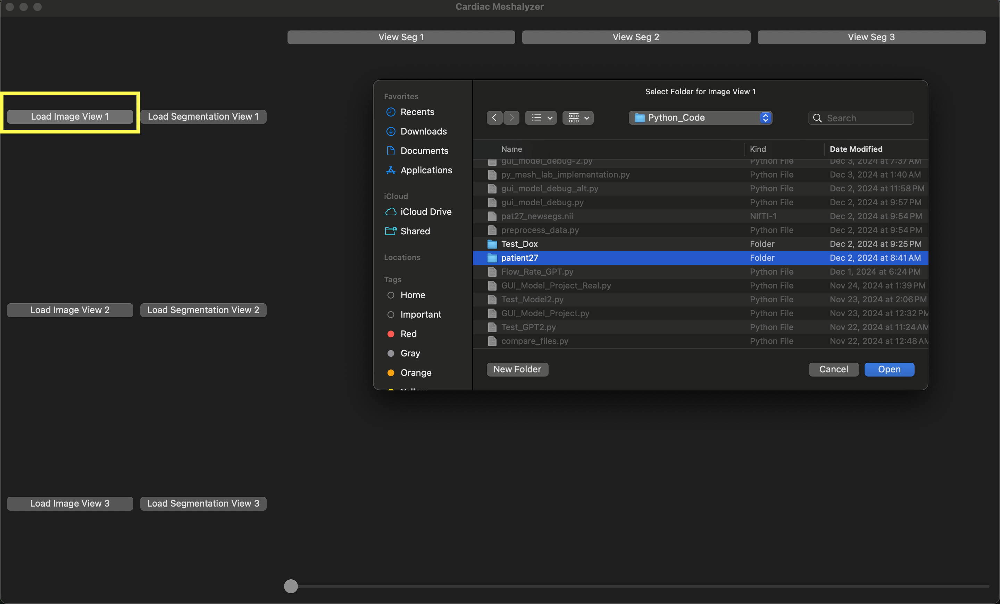
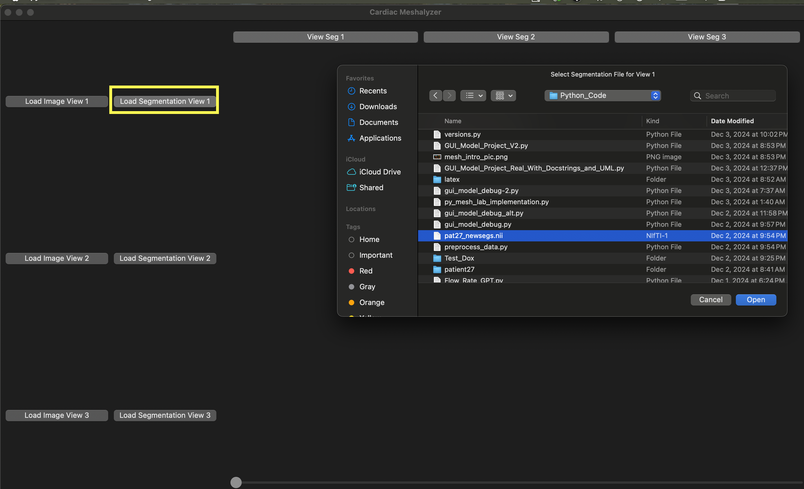
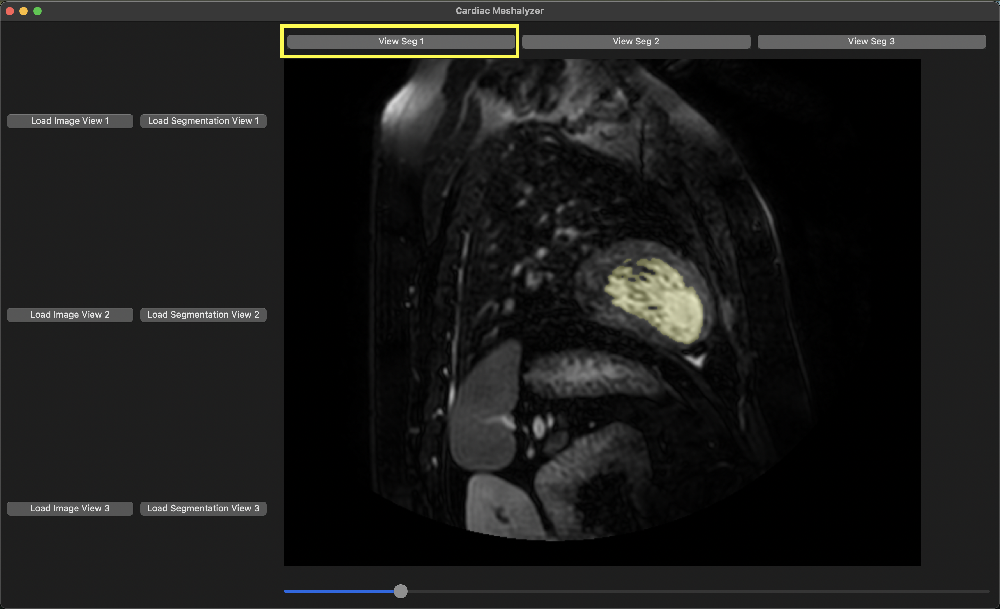
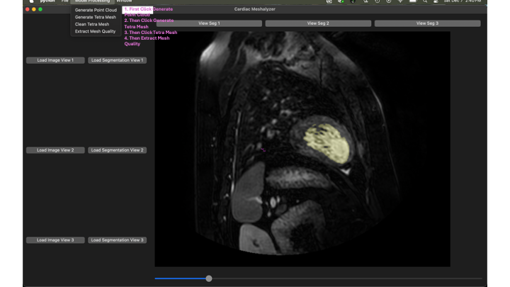
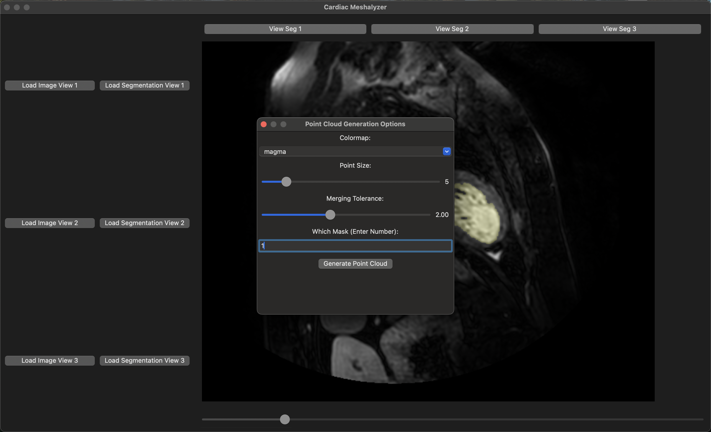
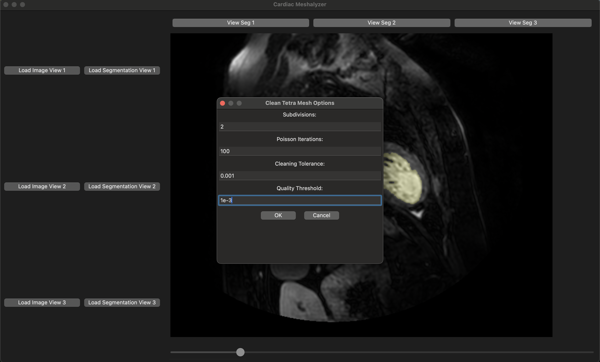

# CardiacModelGenerator


## Overview

CardiacModelGenerator.py is a Python-based application designed for viewing slice overlays, converting pixels to universal coordinates, generating point clouds, and generating/enhancing tetrahedral meshes. Specifically, this is for cardiac models and uses MRI DICOM images and nifti masks.


### How to Use

1. First install via 

```bash
pip install CardiacModelGenerator
```
2.  Then run the following in python either in an IDE or via terminal: 

```bash 
from CardiacModelGenerator import CardiacModelGenerator 
CardiacModelGenerator.main()
```

__If you are having problems with the pip install especially if you are using Apple Silicon. These problems are known to exist due to known issues with wx and 
Apple Silicon. Please try to first purge all the cache and make a new environemnt with latest python version (3.13). A workflow is shown below__:

An example of this is below: 


If successfully run, the following should appear: 


3. Dowload the files in the example files. There should be a patient27 folder which has dicoms and a nii file. 

4. Click Load ImageView1 and navigate/click to the patient27 folder: 



5. Do the same with the LoadSegs; however, navigate and click the nii file: 



6. After this you can use the tool. First you can click View Seg1 and scroll through the overlays. 


7. Now, you can generate the point cloud, tetra mesh, clean the mesh, and get the quality metric. Ensure you do this 
in this order. To access these functions, go to the mesh processing at the top. 


8. For the point cloud, you have to give parameters. Examples of parameters is below: 


9. After you make a mesh by clicking the make tetra mesh option. You can clean the mesh. Example parameters are below: 


10. Finally, you can click the extract mesh quality. 


## Features

Image/Mask Viewer: Allows for a user to scroll through overlays of a mask and image Point Clouds: Can generate point cloud based on user inputs Universal Coordinates: Convers Mask/Image data to universal coordinates based on Dicom metadata Mesh: Allows for tetrahedral meshes from user inputs

### Requirements

__<u>All the requirements should be installed when you pip install the package. <\u>__

If there are issues: 

wx numpy pydicom nibabel cv2 (OpenCV) random matplotlib pyvista Install dependencies using:

pip install wxpython numpy pydicom nibabel opencv-python matplotlib pyvista How to Use

### Input Data 
Input Data: Prepare images in a folder (should be dicoms). Have masks as nifti. Examples of data are given in the github. 


### GUI
Interactive GUI: The script uses wx for GUI, allowing you to interactively select data and configure settings. Visualize Point Clouds: Choose from multiple colormaps and adjust parameters like point_size and tol. 
Select Dicom Image Folder
User selects mask for that folder
User clicks view segmentation
User selects generate Point Cloud
User selects generate mesh
User selects fix mesh
User can look at quality by clicking mesh quality


Developed by vinayjani. Contributions and suggestions are welcome!

License

This project is licensed under the MIT License. See LICENSE for details.